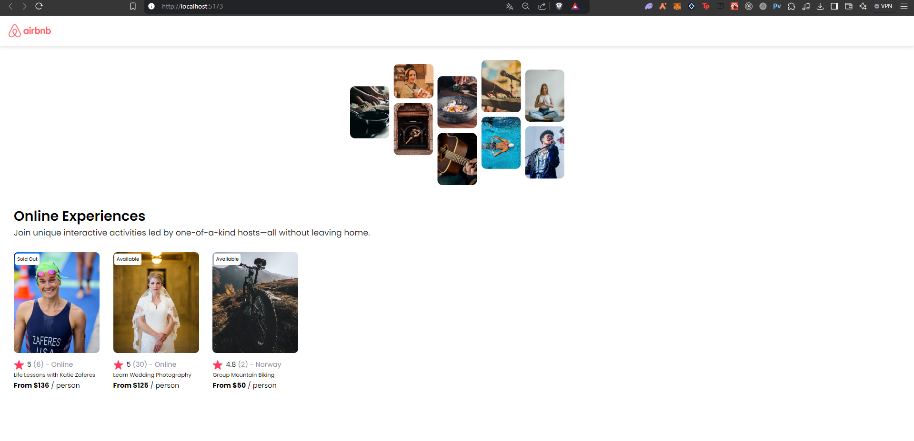
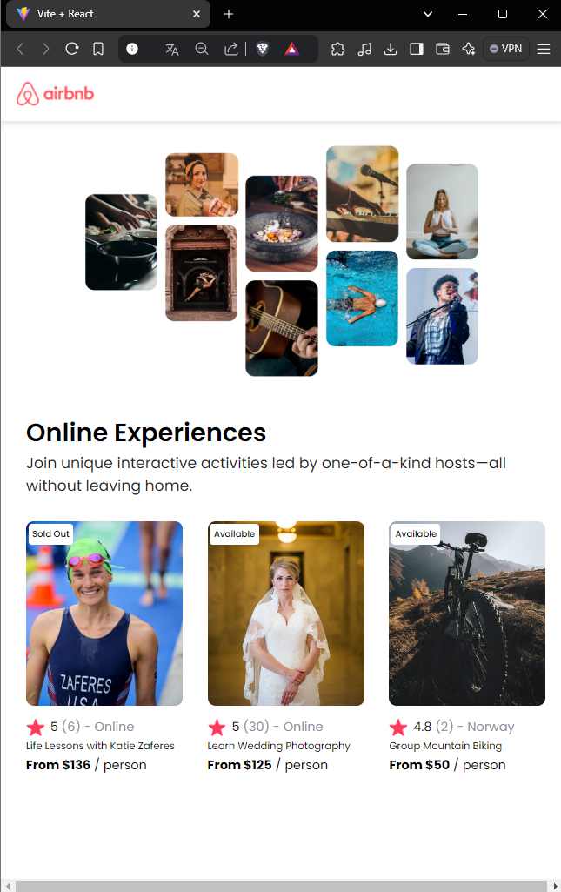

# AirBnb Experiences Project

This project is a simple React application that displays a list of online experiences with key details such as title, price, location, and rating. Users can view the available experiences and their statuses (e.g., "Sold Out" or "Available"). The project showcases how to dynamically map through data to create components.

## Features

- **Navbar**: A navigation bar that provides a title for the app.
- **Hero Section**: A visually appealing section with a main image and a short description of online experiences.
- **Experience Cards**: Displays a list of experiences with details such as the experience title, price, location, rating, and availability status. The cards are built dynamically using the provided data.
- **Dynamic Content**: The project uses React's `map` function to generate multiple cards based on the data, making it easy to scale and add more experiences.
  
## Data Handling

The data for the experiences is stored in a separate file and passed into the card component as props. Each experience card displays:
- An image representing the experience
- Status label ("Sold Out" or "Available")
- Title of the experience
- Price of the experience
- Location and rating

## Screenshots

### Main Section

### Mobile View

## Styling

The project uses custom CSS for styling:
- **Card Layout**: Experience cards are displayed with images, status labels, and details.
- **Hero Section**: Features a prominent image and text with a clean and modern look.
- **Responsive Design**: Adjusts layout based on screen size to ensure the app looks good on both desktop and mobile devices.

## Usage

To use this project:
1. Clone the repository.
2. Run `npm install` to install dependencies.
3. Start the app with `npm start`.
4. Explore the list of online experiences through the dynamic cards.

## Technologies Used

- **React**: For building the user interface components.
- **CSS**: For custom styling of the components and layout.
- **Props and Mapping**: React props and array mapping are used to dynamically render experience cards from the data file.

## Future Improvements

- Add filtering options (e.g., by price or location).
- Allow users to click on each card to view more details about the experience.
- Add a search bar to help users find specific experiences.

This project is a fun and simple way to explore how React can be used to dynamically render and style components based on data.
