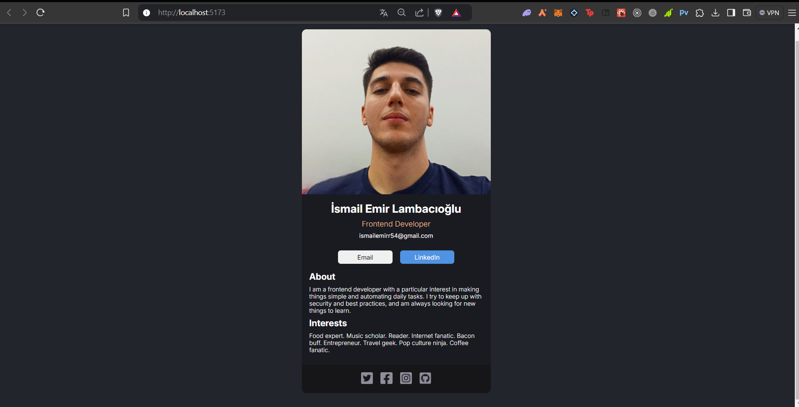

# Digital Business Card

This project is a simple, responsive portfolio webpage created with React, featuring clean and modern design, utilizing CSS for styling and incorporating social media icons to enhance interactivity.

## Features

- **Profile Header**: Displays a profile picture, name, and job title.
- **Contact Information**: Contains buttons for email and LinkedIn communication.
- **Bio Section**: Provides a brief description of the developer and personal interests.
- **Social Media Links**: Includes clickable icons for Twitter, Facebook, Instagram, and GitHub.
- **Responsive Design**: Adapts to different screen sizes for a better user experience.

## Technologies Used

- **React**: For building the UI components.
- **CSS**: For custom styling and layout design.
- **Responsive Design**: Media queries ensure that the design works across various devices.
- **Images and Icons**: Used to add visual elements and social media interactivity.

## Screenshots

### Main Content

## Desired Outcome

The goal of this project is to present a simple and informative portfolio page that showcases a developer’s profile, contact details, and social links, all in a visually appealing format with responsive design principles.

---

Let me know if you'd like any changes or additional details!
