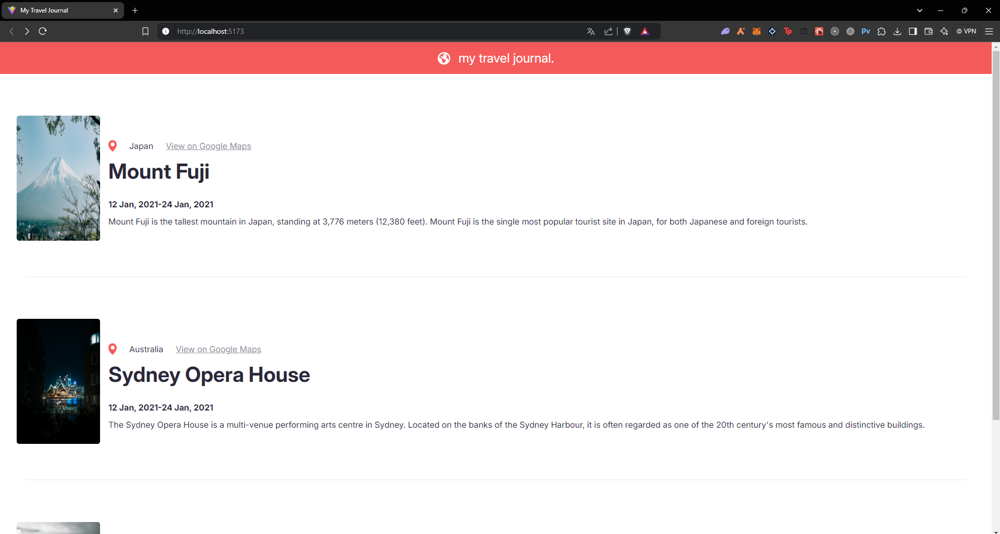
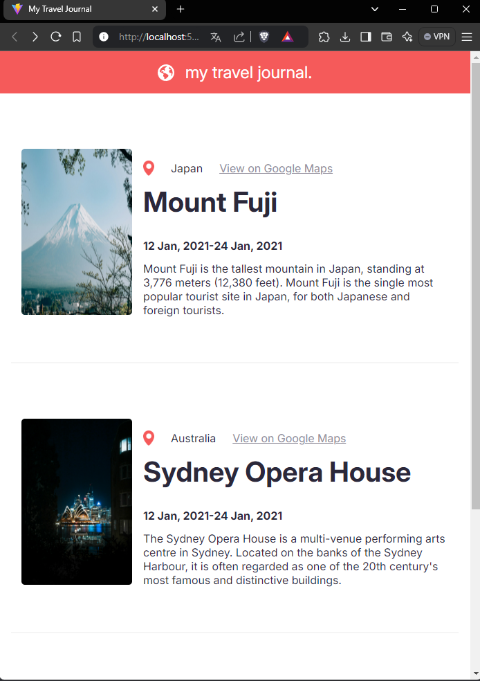
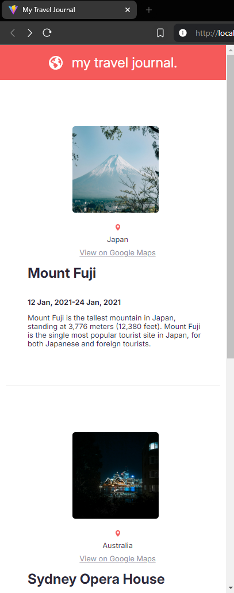

# Travel Journal React

A simple travel journal web application built with React, showcasing a list of places with details like location, Google Maps link, description, and travel dates. The app is responsive and provides views for desktop, mobile, and mini mobile screen sizes.

## Features

- **Responsive Design**: The layout adapts to different screen sizes, providing a smooth user experience on desktop, mobile, and smaller mobile devices.
- **React Components**: The app is built with reusable components for better modularity.
  - `Header`: Displays the logo and the app title.
  - `Card`: Displays information about each travel destination.
- **Card Component**: Each card displays:
  - A location image.
  - Travel destination name and location.
  - Google Maps link for easy navigation.
  - Travel dates and a brief description of the destination.
  
## Screenshots

The app provides three different views:
1. **Desktop View**: For screens larger than 1200px.
2. **Mobile View**: For screens between 462px and 1200px.
3. **Mini Mobile View**: For screens smaller than 461px.

Include screenshots for each view here:

- **Desktop View**: 

- **Mobile View**: 

- **Mini Mobile View**: 

## File Structure

- `App.js`: The main component that brings together the header and card components.
- `Header.js`: A simple header with an image and title.
- `Card.js`: Contains the layout and structure for each travel destination card.
- `data.js`: Contains the travel destination data (location, date, image, description).
- `card.css`: Styling for the `Card` component, including responsive styles for various screen sizes.
- `hero.css`: Styling for the `Header` component.

## Technologies Used

- React
- CSS (for styling and responsive design)
- HTML
- JavaScript
- Vite
- Figma

## License and Outcome

This project is licensed under the MIT License. This version reflects the desired final outcome, including responsive design and a clean, functional UI across different devices. Remember to replace the screenshot placeholders with actual image paths or URLs.
